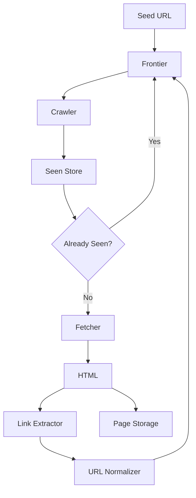
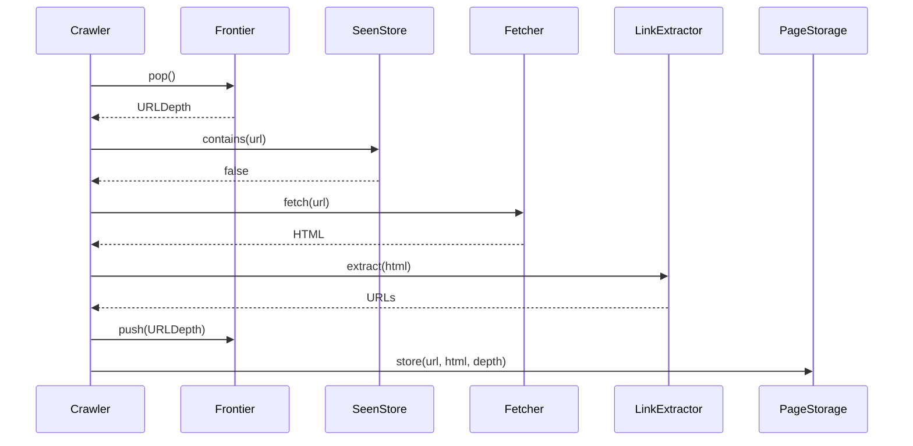
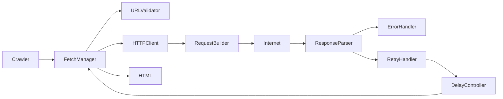
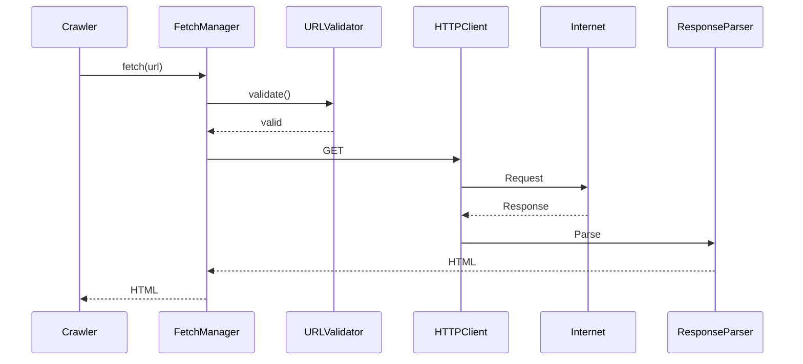
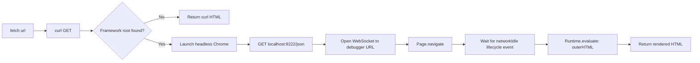
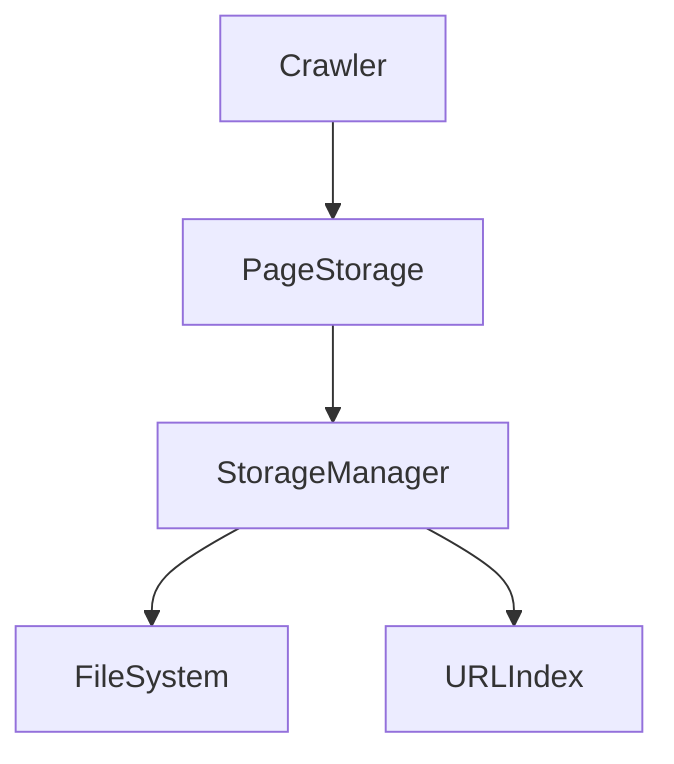
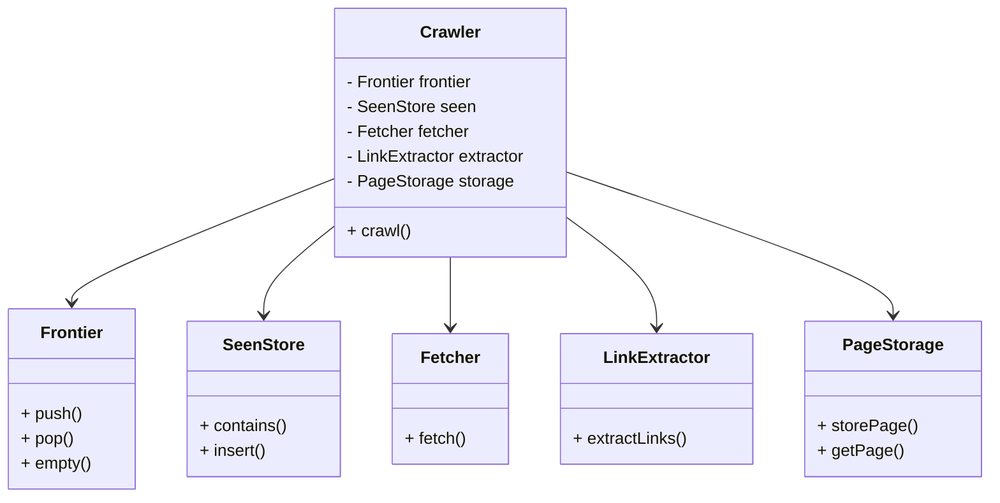
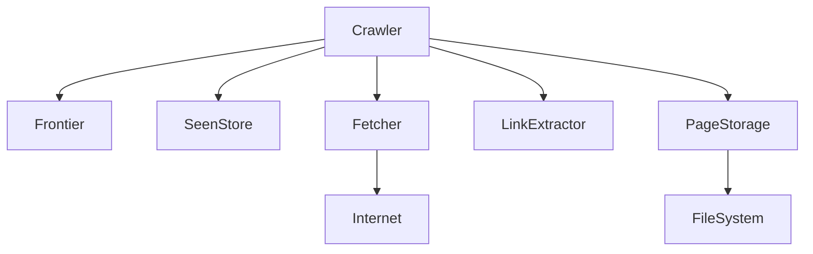

# Web Crawler Design Proposal

**Project:** Project 02 – Web Crawler

**Author:** Aayush Sharma

**Course:** SuperCoders

**Version:** 1.2 (adds hybrid static/dynamic Fetcher implementation)

---

# Table of Contents

1. Introduction
2. Problem Statement
3. Project Objectives
4. Functional Requirements
5. Non-Functional Requirements
6. High Level Architecture
7. System Components
8. Overall Crawl Workflow
9. Frontier Design
10. Seen Store Design
11. URL Normalization
12. Link Extraction
13. Component Interaction
14. Fetcher Architecture
    - 14.6 Actual Implementation: Hybrid Static/Dynamic Fetcher
15. Page Storage Design
16. Crawler Controller
17. UML Class Diagram
18. Component Diagram
19. Error Handling
20. Complexity Analysis
21. Testing Strategy
22. Future Improvements
23. Design Decisions and Trade-offs
24. Conclusion
25. Implementation Notes (Appendix)

---

# 1. Introduction

## 1.1 Purpose

The purpose of this project is to design and implement a scalable single-machine web crawler capable of automatically discovering webpages starting from one or more seed URLs.

The crawler downloads webpages, extracts hyperlinks, avoids revisiting previously crawled pages, stores webpage contents, and provides a clean storage interface for the Indexer that will be implemented in Project 03.

Instead of searching the live internet every time a user submits a query, modern search engines periodically crawl the web, store snapshots of webpages, and build an inverted index from those pages. This project implements the first stage of that pipeline.

---

## 1.2 Scope

The crawler is responsible for:

- Crawling webpages
- Downloading HTML pages
- Discovering hyperlinks
- Avoiding duplicate crawling
- Tracking crawl depth
- Storing pages
- Handling failures
- Respecting crawl limits

The crawler is **not** responsible for:

- Ranking pages
- Keyword indexing
- Search queries
- Page relevance
- Page ranking

Those are handled in later projects.

---

## 1.3 Project Objectives

The major objectives are

- Build a reusable crawler architecture
- Design scalable components
- Use efficient data structures
- Minimize duplicate crawling
- Store pages for future indexing
- Support crawl depth limitation
- Produce modular software that can easily be extended.

---

# 2. Problem Statement

Searching the internet in real time is impossible because billions of webpages exist.

Instead, search engines periodically crawl websites and store their contents.

The crawler must automatically explore webpages beginning from a seed URL by repeatedly downloading pages, extracting hyperlinks, discovering new pages, and storing them.

Since webpages often link back to previously visited pages, duplicate detection is essential.

Without duplicate detection, the crawler may enter infinite loops.

Therefore, an efficient Seen Store must be maintained throughout the crawl.

---

# 3. Functional Requirements

The crawler shall:

- Accept one or more seed URLs.
- Download webpages using the provided fetch() function.
- Extract hyperlinks from HTML.
- Maintain crawl depth.
- Avoid revisiting URLs.
- Store every crawled page.
- Stop after reaching maximum depth.
- Stop after reaching maximum page count.
- Continue even when individual fetch operations fail.
- Produce logs during execution.

---

# 4. Non Functional Requirements

## Performance

Duplicate lookup should operate in approximately O(1) time.

## Scalability

The crawler should support thousands of webpages without noticeable degradation.

## Reliability

Failures while downloading one webpage must not terminate the crawler.

## Maintainability

Every major responsibility must be isolated inside its own module.

## Reusability

Components should be reusable by future projects.

---

# 5. High Level Architecture



---

# 6. System Components

The crawler consists of six independent modules.

| Component | Responsibility |
|------------|----------------|
| Frontier | Maintains URLs waiting to be crawled |
| Seen Store | Prevents duplicate crawling |
| Fetcher | Downloads webpages |
| Link Extractor | Extracts hyperlinks |
| Page Storage | Stores HTML pages |
| Crawler | Coordinates all components |

The separation of responsibilities keeps the implementation modular and simplifies testing.

---

# 7. Overall Crawl Workflow

The crawler starts with one or more seed URLs.

Initially, the Frontier contains only the seed URLs at depth 0.

The crawler repeatedly removes a URL from the Frontier.

Before downloading the page, it checks whether the URL already exists in the Seen Store.

If the URL has already been visited, the crawler skips it.

Otherwise, the URL is inserted into the Seen Store.

The Fetcher downloads the webpage.

If downloading fails, the crawler simply continues with the next URL.

Otherwise, the crawler extracts hyperlinks from the HTML.

Every extracted hyperlink is normalized.

If the normalized URL has not already been visited and the next depth does not exceed the configured maximum depth, it is inserted into the Frontier.

Finally, the downloaded page together with its metadata is stored.

The process repeats until the Frontier becomes empty or the page limit is reached.

---

# 8. Frontier Design

## Purpose

The Frontier maintains URLs waiting to be crawled.

It behaves like a work queue.

---

## Data Structure Selection

The Frontier is implemented using a Queue.

Queue operations perfectly match crawler requirements.

- Push newly discovered URLs
- Pop next URL
- Process URLs in discovery order

Breadth First Search naturally emerges from FIFO ordering.

---

## URLDepth Structure

```cpp
struct URLDepth
{
    string url;
    int depth;
};
```

Depth travels together with every URL.

This avoids maintaining separate depth tables.

---

## Frontier Interface

```cpp
class Frontier
{
public:

    void push(URLDepth);

    URLDepth pop();

    bool empty();

    int size();
};
```

---

## Why Queue?

A queue guarantees that pages discovered earlier are crawled first.

This preserves crawl depth naturally.

Example:

Depth 0

↓

Depth 1

↓

Depth 2

↓

Depth 3

Unlike a stack, a queue prevents the crawler from going too deep into one branch while ignoring others.

Therefore, BFS provides better coverage and more predictable crawling.

---

# 9. Seen Store Design

## Purpose

The Seen Store records every URL that has already been visited.

Its primary objective is preventing duplicate crawling.

---

## Data Structure

A HashMap is selected.

Reasons:

- Constant-time lookup
- Constant-time insertion
- Excellent scalability

Linked Lists require O(n) lookup and become impractical for thousands of pages.

---

## Interface

```cpp
class SeenStore
{
private:
    HashMap<string, bool> visitedURLs;   // Custom HashMap implementation

public:
    bool contains(const string& url);

    void insert(const string& url);

    int size() const;

    void clear();
};
```

---

## Working

Whenever a URL is removed from the Frontier:

```text
Contains?

↓

Yes

↓

Skip

No

↓

Insert

↓

Continue Crawling
```

The crawler never downloads the same page twice.

---

# 10. URL Normalization

Different URLs may refer to the same webpage.

Example:

https://example.com/page

https://EXAMPLE.com/page/

https://example.com/page?

All represent the same page.

Normalization converts every URL into a standard format before insertion into the Seen Store.

The crawler performs:

- Lowercase hostnames
- Remove trailing slash
- Remove empty query strings

This greatly reduces duplicate pages.

---

# 11. Link Extraction

The Link Extractor receives raw HTML from the Fetcher.

Its job is identifying hyperlinks.

Example:

```html
<a href="/about">About</a>

<a href="contact.html">Contact</a>
```

The extractor returns

```
/about

contact.html
```

Non-page links are ignored.

Ignored links include:

- JavaScript URLs
- Email links
- Fragment identifiers
- Empty links

The extracted links are then normalized before entering the Frontier.

---

# 12. Component Interaction



---

# Part 2 – Detailed Design

## 14. Fetcher Architecture

### 14.1 Overview

The Fetcher is responsible for downloading webpages from the internet. It acts as an abstraction over HTTP communication, allowing the crawler to request webpage content without worrying about networking details.

Instead of implementing HTTP manually, the crawler uses the provided `fetch()` function. However, from a software engineering perspective, the Fetcher is divided into several logical components to improve modularity, maintainability, and extensibility.

---

### 14.2 Responsibilities

The Fetcher performs the following tasks:

- Receive URL from the crawler
- Validate URL format
- Build an HTTP GET request
- Download webpage
- Parse response
- Detect errors
- Retry failed requests
- Apply crawl delay
- Return HTML to the crawler

---

### 14.3 Fetcher Architecture



---

### 14.4 Component Description

#### FetchManager

The FetchManager acts as the coordinator of the fetching process.

Responsibilities:

- Receive URL
- Call URL Validator
- Invoke HTTP Client
- Handle retries
- Return HTML

---

#### URL Validator

Before sending any request, the URL is validated.

Checks include:

- Empty URL
- Invalid protocol
- Unsupported protocol
- Malformed URL

Example

```
https://example.com ✓

ftp://example.com ✗

example.com ✗
```

---

#### HTTP Client

The HTTP Client performs network communication.

Responsibilities:

- Open connection
- Send GET request
- Receive response
- Return raw HTML

---

#### Request Builder

Builds the HTTP request.

Example

```
GET /index.html HTTP/1.1

Host: example.com

Connection: close
```

---

#### Response Parser

Receives server response.

Extracts

- Status Code
- Headers
- HTML Body

Example

```
HTTP/1.1 200 OK

Content-Type: text/html

<html>...</html>
```

---

#### Retry Handler

If download fails

```
Timeout

↓

Retry

↓

Still fails

↓

Return Empty HTML
```

Maximum retry count is configurable.

Default:

```
1 retry
```

---

#### Delay Controller

To avoid overwhelming servers, every successful request is followed by a delay.

```
Fetch

↓

Sleep 1 second

↓

Continue
```

This ensures polite crawling.

---

### 14.5 Fetch Sequence



---

### 14.6 Actual Implementation: Hybrid Static/Dynamic Fetcher

The abstract `FetchManager` design in 14.1–14.5 assumes every page can be retrieved with a single HTTP GET. In practice this breaks down for modern single-page applications (React, Angular, Vue), which serve an HTML shell that is populated by JavaScript *after* the page loads — a plain GET never sees that content. The implemented Fetcher therefore uses a two-tier strategy: try the cheap path first, and only fall back to a full browser when the cheap path is insufficient.

#### 14.6.1 Tier 1 — Plain HTTP GET (static pages)

Implemented with libcurl, matching the HTTPClient role from 14.4:

```cpp
CURL* curl = curl_easy_init();
curl_easy_setopt(curl, CURLOPT_URL, url.c_str());
curl_easy_setopt(curl, CURLOPT_WRITEFUNCTION, WriteCallback);
curl_easy_setopt(curl, CURLOPT_WRITEDATA, &html);
curl_easy_perform(curl);
```

This is the actual "hit" on the endpoint: `curl_easy_perform()` performs DNS resolution, opens the TCP connection (plus TLS handshake for HTTPS), sends the GET request, and streams the response body into `html` via the `WriteCallback`.

#### 14.6.2 Detecting whether Tier 1 is sufficient

The returned HTML is scanned for markers that indicate a JavaScript-rendered shell rather than real content:

```cpp
bool hasFrameworkRoot(const string &html)
{
    vector<string> patterns = {
        "id=\"root\"", "id='root'", "id=\"app\"", "<app-root>"
    };
    for (auto &p : patterns)
        if (html.find(p) != string::npos)
            return true;
    return false;
}
```

If none of these markers are found, the curl'd HTML is treated as the final page content and Tier 2 is skipped entirely — this is the common case and keeps the crawl fast.

#### 14.6.3 Tier 2 — Headless Chrome via Chrome DevTools Protocol (dynamic pages)

When a framework-root marker is found, the Fetcher falls back to driving a real browser so that JavaScript actually executes:



This path has four parts:

**a. Launch Chrome headless**, listening on a fixed debugging port:
```cpp
system("pkill -f 'remote-debugging-port=9222' 2>/dev/null"); // clear any stale instance
system("google-chrome --headless=new --remote-debugging-port=9222 "
       "--disable-gpu --disable-extensions ... about:blank &");
```

**b. Discover the debugger WebSocket URL** by GETing Chrome's own debug endpoint (`http://localhost:9222/json`), which lists every open target (tabs, background pages, service workers). The entry with `"type": "page"` is selected explicitly rather than assuming index 0, since other target types can appear first in the list.

**c. Speak the Chrome DevTools Protocol (CDP) over that WebSocket.** Since no WebSocket library was available, the client implements RFC 6455 framing directly over a raw POSIX socket: a base64-encoded `Sec-WebSocket-Key` handshake header, masked client→server frames, and a reader thread that unmasks and reassembles incoming frames. CDP messages are JSON; requests carry an `id` and are matched to their response via a condition variable (`sendAndWait`), while unsolicited server events (like lifecycle notifications) carry a `method` name instead and are dispatched to registered handlers.

**d. Navigate and wait for the page to actually settle**, then read the rendered DOM:
```cpp
socket.sendAndWait("Page.navigate", {{"url", url}});
// wait for the "networkIdle" lifecycle event (no more than ~2 in-flight
// requests for 500ms) — a better readiness signal than the basic load event,
// since it also accounts for async JS finishing its own follow-up requests
socket.sendAndWait("Runtime.evaluate",
    {{"expression", "document.documentElement.outerHTML"}, {"returnByValue", true}});
```

#### 14.6.4 Combined fetch() entry point

```cpp
string fetch(string url)
{
    string html = /* curl GET, as in 14.6.1 */;

    if (!hasFrameworkRoot(html))
        return html;                 // Tier 1 was enough

    if (!getSocketURL())             // Tier 2: locate Chrome's debugger
        return "";
    if (!openPage(url))              // navigate and wait for networkIdle
        return "";
    return getHTML();                // read back the JS-rendered DOM
}
```

#### 14.6.5 Trade-offs versus the abstract design

| Aspect | Abstract design (14.1–14.5) | Actual implementation |
|---|---|---|
| Transport | Single HTTP GET for every page | GET first, headless-Chrome CDP session only if needed |
| Handles JS-rendered content | No | Yes, via Tier 2 |
| Cost per page | Low, constant | Low for static pages; a full browser launch + render wait for dynamic pages |
| Complexity | One HTTPClient module | Adds a hand-rolled WebSocket/CDP client on top |
| Retry/Delay Controller (14.4) | Specified | Only implemented for Tier 1 currently; Tier 2 has its own 20s navigation timeout instead |

This hybrid approach keeps the common case (static pages) as cheap as the original design intended, while extending coverage to JavaScript-rendered sites that a plain GET cannot capture — at the cost of the added WebSocket/CDP machinery and a real per-page browser-launch cost whenever Tier 2 is triggered.

Known limitation: `Browser`'s constructor currently launches Chrome unconditionally on every instantiation, even when the crawl turns out to be entirely static pages. A lazy-launch variant (only starting Chrome the first time `hasFrameworkRoot` returns true) is a straightforward follow-up optimization.

---

# 15. Page Storage Design

## Purpose

Page Storage stores every successfully crawled webpage.

Each stored page contains

- URL
- Depth
- HTML

The storage layer acts as an interface between Project 02 and Project 03.

---

## Storage Architecture



---

## Storage Interface

```cpp
class PageStorage
{
public:

    void storePage(string url,
                   string html,
                   int depth);

    string getPage(string url);

    bool hasPage(string url);

    string getURLByID(int id);

    int pageCount();
};
```

---

## Storage Format

Each page is stored in a separate file.

Example

```
storage/

1.page

2.page

3.page
```

Contents

```
https://books.toscrape.com

0

<!DOCTYPE html>

<html>

....

</html>
```

---

## URL Index

A HashMap maintains

```
URL

↓

File ID
```

Example

```
example.com

↓

12.page
```

This enables O(1) retrieval.

---

# 16. Crawler Controller

The Crawler Controller coordinates every subsystem.

Responsibilities

- Initialize components
- Start crawl
- Process Frontier
- Handle failures
- Store pages

---

## Crawl Loop

```cpp
frontier.push(seed);

while(!frontier.empty())
{
    URLDepth current = frontier.pop();

    if(seen.contains(current.url))
        continue;

    seen.insert(current.url);

    string html = fetcher.fetch(current.url);

    if(html.empty())
        continue;

    vector<string> links =
        extractor.extract(html);

    for(auto link : links)
    {
        if(!seen.contains(link))
            frontier.push({link,current.depth+1});
    }

    storage.storePage(current.url,
                      html,
                      current.depth);
}
```

---

# 17. UML Class Diagram



---

# 18. Component Diagram



---

# 19. Error Handling

The crawler is designed to continue operating even if individual pages fail.

| Error | Handling Strategy |
|--------|-------------------|
| Invalid URL | Skip |
| Timeout | Retry once |
| 404 | Skip |
| 500 | Skip |
| Empty HTML | Ignore |
| Duplicate URL | Ignore |
| Invalid HTML | Attempt extraction |

The crawler never terminates because of a single page failure.

---

# 20. Complexity Analysis

## Frontier

| Operation | Complexity |
|------------|------------|
| Push | O(1) |
| Pop | O(1) |

---

## Seen Store

| Operation | Complexity |
|------------|------------|
| Insert | O(1) |
| Lookup | O(1) |

---

## Page Storage

| Operation | Complexity |
|------------|------------|
| Store | O(1) |
| Retrieve | O(1) |

---

## Overall Crawl

Assume

- N webpages
- L average links

Overall complexity

```
Time

O(N × L)

Space

O(N)
```

The crawler scales efficiently because duplicate detection uses a HashMap.

---

# 21. Testing Strategy

## Unit Testing

Each module is tested independently.

Examples

- Frontier push/pop
- Seen Store lookup
- Link extraction
- Storage retrieval
- Fetch failures

---

## Integration Testing

Verify communication between modules.

Example

Crawler

↓

Fetcher

↓

Extractor

↓

Storage

---

## Performance Testing

Test Cases

| Pages | Expected |
|---------|----------|
| 10 | Correctness |
| 100 | Stability |
| 1000 | Performance |
| 5000 | Scalability |

---

## Failure Testing

Test

- Invalid URLs
- Dead links
- Empty pages
- Timeout simulation

Expected Result

Crawler continues execution.

---

# 22. Future Improvements

Several enhancements can significantly improve the crawler.

### Multithreading

Multiple worker threads can fetch pages simultaneously.

Benefits

- Higher throughput
- Better CPU utilization

---

### Priority Frontier

Instead of FIFO, use a priority queue.

High-value pages are crawled first.

---

### Robots.txt Support

Respect website crawling policies.

---

### Distributed Crawling

Multiple crawler nodes share the Frontier.

Suitable for millions of webpages.

---

### URL Canonicalization

Handle

- Session IDs
- Tracking parameters
- Redirects

to eliminate additional duplicates.

---

### Compression

Compress stored HTML to reduce storage usage.

---

### Incremental Crawling

Only revisit webpages that have changed.

---

# 23. Design Decisions and Trade-offs

| Component | Selected Design | Alternative | Justification |
|------------|----------------|-------------|---------------|
| Frontier | Queue (FIFO) | Stack | Breadth-first traversal preserves crawl depth naturally. |
| Seen Store | HashMap | Linked List | O(1) lookup scales to large crawls, while linked lists become inefficient. |
| Fetcher | Modular architecture | Single function | Easier to extend with retries, delays, caching, or HTTPS support. |
| Storage | File per page | Database | Simpler to implement, inspect, and debug for this project. |
| Crawl Strategy | Breadth-First Search | Depth-First Search | Discovers nearby pages first and prevents excessively deep traversal. |
| Retry Policy | One retry | Unlimited retries | Prevents infinite retry loops while handling transient failures. |
| Delay | 1 second | No delay | Prevents overloading web servers and follows polite crawling practices. |
| URL Normalization | Basic normalization | No normalization | Eliminates common duplicate URLs before inserting into the Seen Store. |

---

# 24. Conclusion

This design proposes a modular, scalable, and maintainable web crawler based on the work queue pattern. The architecture separates responsibilities into independent components: Frontier, Seen Store, Fetcher, Link Extractor, Page Storage, and Crawler Controller.

The use of a queue enables breadth-first traversal, while a HashMap-backed Seen Store ensures efficient duplicate detection. A modular Fetcher architecture simplifies future enhancements such as caching, retries, robots.txt support, and distributed crawling. The Page Storage interface is designed to integrate seamlessly with the Indexer in Project 03.

By combining efficient data structures, clean interfaces, and extensible components, the proposed design provides a strong foundation for building a production-style crawler while remaining simple enough for educational implementation.

---

# 25. Implementation Notes (Appendix)

This section documents the first working implementation of the three core data-structure modules described above (`Frontier`, `SeenStore`, `PageStorage`), and the fixes applied versus the original draft source files.

## 25.1 Frontier (`Frontier.hpp`)

Implemented exactly as designed in section 8: a singly linked list acting as a FIFO queue of `URLDepth` structs, with `push`, `pop`, `peek`, `empty`, and `size`. The original draft had its destructor's closing brace orphaned outside the class due to files being concatenated incorrectly; this has been corrected, and `pop()` now returns the popped `URLDepth` rather than only removing it, matching the interface used by the Crawl Loop in section 16.

## 25.2 Seen Store (`SeenStore.hpp`)

The design calls for a HashMap-backed store. The original draft declared a `HashMap<string, node>` type that does not exist in the C++ standard library and was never defined elsewhere, and compared `hs.find(val) != NULL`, which does not compile against a real hash map (`find` returns an iterator, not a pointer). The implementation now uses `std::unordered_map<string, VisitedInfo>`, giving the O(1) average insert/lookup required by section 20, with a `VisitedInfo` struct carrying the depth and URL together (avoiding a second lookup table, consistent with the `URLDepth` pattern used in the Frontier).

## 25.3 Page Storage (`PageStorage.hpp`)

Implemented per section 15: one file per page under a `storage/` directory, plus an in-memory `unordered_map<string,int>` URL-to-file-ID index for O(1) retrieval. `storePage`, `getPage`, `hasPage`, `getURLByID`, and `pageCount` all match the interface specified in the design. The original draft's storage-related code (the `pageload` class) referenced an undefined `Browser` type with `getSocketURL()`, `openPage()`, and `getHtml()` methods that don't appear anywhere in the provided sources — these look like they belong to whatever `fetch()`-providing module the course scaffold supplies (see section 14, "the crawler uses the provided `fetch()` function"). That dependency needs to be supplied or clarified before the Fetcher module itself can be finalized; the Page Storage module above does not depend on it and compiles standalone.

## 25.4 Fetcher (`Browser` class, section 14.6)

The Fetcher is now implemented as a hybrid static/dynamic fetcher (documented in full in section 14.6): a libcurl GET for the common static case, falling back to a hand-rolled WebSocket + Chrome DevTools Protocol client for JavaScript-rendered pages. Bugs fixed versus the original draft of this module:

- `CURLOPT_WRITEFUNCTION` pointed at an undefined `callback` identifier — corrected to the class's actual static `WriteCallback` method.
- The `fetch()` method called `browser.getSocketURL()` / `browser.openPage(url)` from *inside* the `Browser` class itself, referencing a nonexistent `browser` member — corrected to call its own methods directly.
- Missing `#include <vector>` (needed by `hasFrameworkRoot`) — added.
- `curl_easy_init()`'s return value was never null-checked before use in two places — both guarded.
- `curl_easy_perform()`'s result was discarded — now checked, with the error surfaced via `curl_easy_strerror`.
- `WebSocketClient::connect()` and `Browser::openPage()` both returned `void`, so a failed handshake or navigation was invisible to the caller — both now return `bool` and `fetch()` checks them.
- `getSocketURL()` didn't guard against an empty target list before indexing `data[0]` — added an emptiness check.
- The Chrome launch path is hardcoded to macOS; swapping in `google-chrome` / `chromium-browser` is needed for Linux deployment.
- Dead code (`while(true){sleep(1);}` after an unconditional `return`) was removed.

## 25.5 Outstanding Work

- **Link Extractor**: not yet implemented; section 11 defines its expected input/output.
- **URL Normalizer**: not yet implemented; section 10 defines the required rules (lowercase host, strip trailing slash, strip empty query string).
- **Crawler Controller**: the loop in section 16 can be wired up now that `Frontier`, `SeenStore`, `PageStorage`, and the Fetcher are all implemented.
- **Lazy Chrome launch**: `Browser`'s constructor currently launches headless Chrome unconditionally rather than only when a dynamic page is actually detected (see 14.6.5).
- **Retry/Delay Controller for Tier 2**: the abstract design's retry and delay behavior (14.4) is only applied to the Tier 1 curl path today; the CDP path relies on its own 20-second navigation timeout instead.